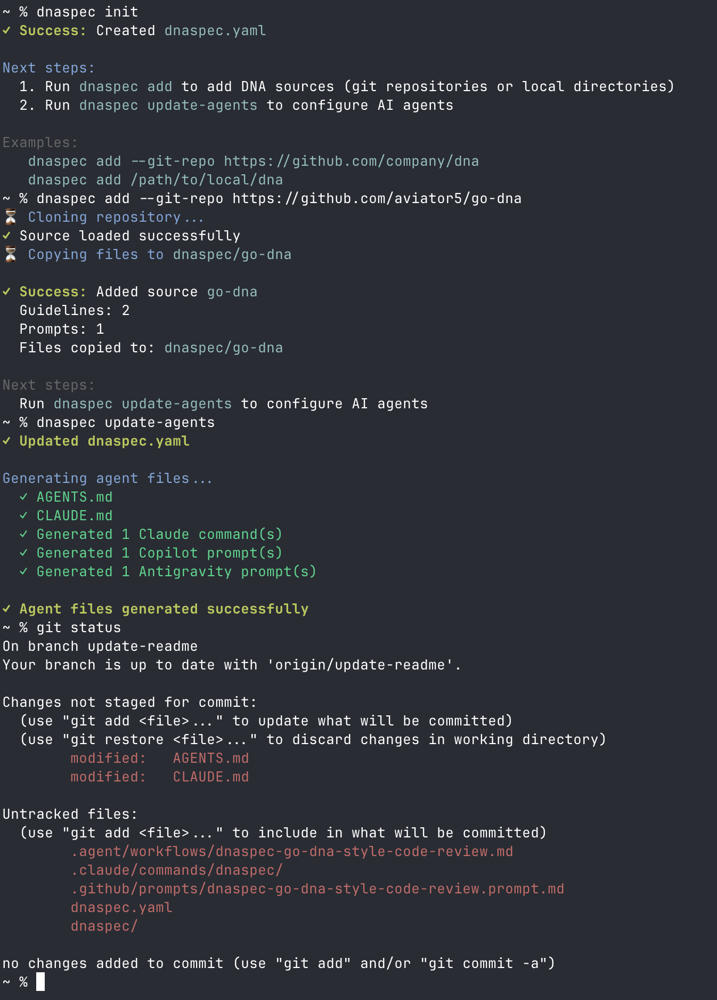
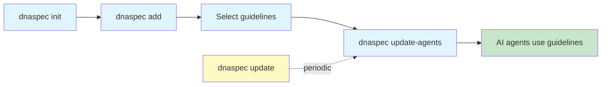
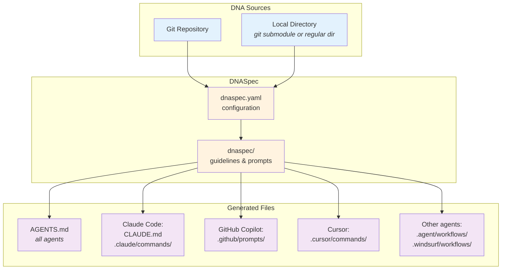
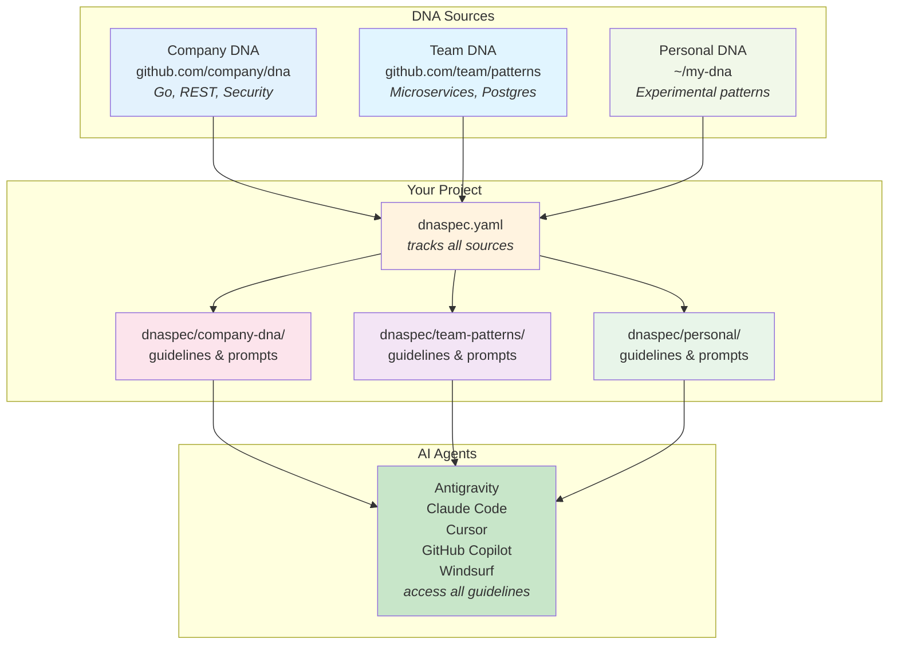

# DNASpec

[](https://github.com/aviator5/dnaspec/actions/workflows/ci.yml)

DNASpec is a CLI tool for managing DNA (Development Norms & Architecture) guidelines across projects. It distributes reusable development patterns from centralized repositories and makes them available to AI coding assistants like Claude Code and GitHub Copilot.

<p align="center">
  
</p>

## What are DNA Guidelines?

DNA guidelines are reusable development patterns, architectural principles, and best practices that can be shared across multiple projects. They help teams:

- **Maintain Consistency**: Apply the same standards across all projects
- **Share Knowledge**: Centralize best practices in version-controlled repositories
- **Empower AI Agents**: Provide context-aware guidance to Claude Code, GitHub Copilot, and other AI assistants
- **Stay Updated**: Pull latest guidelines into projects with a single command

Examples of DNA guidelines:
- Code style conventions (Go, Python, TypeScript)
- Architectural patterns (microservices, hexagonal architecture)
- API design principles (REST, GraphQL)
- Database design patterns (schema design, migrations)
- Security best practices (authentication, authorization)

## Guidelines and Prompts

DNASpec uses two types of content to help AI agents:

### Guidelines

**Guidelines** are markdown documents that define development standards and architectural patterns.

Examples:
- `go-style.md` - Go coding conventions and idioms
- `rest-api.md` - REST API design principles and patterns
- `error-handling.md` - Error handling strategies and best practices
- `database-design.md` - Database schema design patterns

### Prompts

**Prompts** are actionable instructions that tell AI agents how to apply the guidelines.

Examples:
- `go-code-review` - Review code against go-style guideline
- `api-design-review` - Validate API design against REST principles
- `refactor-for-patterns` - Suggest refactoring based on architectural guidelines
- `security-audit` - Audit code for security issues using security guidelines

### How They Work Together

1. **Guidelines provide the "what"**: Standards, patterns, and best practices
2. **AI agents always have access to guidelines**: Through AGENTS.md/CLAUDE.md, AI agents can reference guidelines whenever working in your project
3. **Prompts provide explicit actions**: Specific tasks that tell AI agents exactly what to do (review, validate, generate, etc.)
4. **Prompts become commands**: In Claude Code they become `/` slash commands, in GitHub Copilot they become chat prompts

**Two ways AI agents use guidelines:**

**1. Contextual use (automatic):**
```
User: "Help me refactor this Go function"

Claude Code:
1. Sees you're working with Go code
2. Reads CLAUDE.md and finds go-style guideline applies to "refactoring Go code"
3. References go-style.md guideline automatically
4. Provides refactoring suggestions following the guidelines
```

**2. Explicit use (via prompts):**
```
User types: /dnaspec-company-go-code-review

Claude Code:
1. Executes the go-code-review prompt
2. Reads the go-style.md guideline
3. Reviews code against the guidelines
4. Provides specific feedback with line numbers
```

## Why DNASpec?

**Problem**: Development teams struggle to share and enforce best practices across projects. Guidelines often live in wikis, become outdated, and are hard for AI assistants to access.

**Solution**: DNASpec provides:
- **Centralized Guidelines**: Version-controlled DNA repositories accessible via git
- **Easy Distribution**: Add guidelines to any project with `dnaspec add <repo>`
- **AI Integration**: Automatically generate files for Claude Code, GitHub Copilot, and future AI tools
- **Stay Updated**: Pull latest guidelines with `dnaspec update`
- **Multi-Source Support**: Combine guidelines from multiple repositories (see Multiple DNA Sources below)

## Supported AI Agents

**Currently Supported:**
- **Antigravity** - AI development assistant
- **Claude Code** - Anthropic's AI assistant with slash commands and project context
- **Cursor** - AI-first code editor
- **GitHub Copilot** - GitHub's AI pair programmer with chat prompts
- **Windsurf** - AI-powered code editor

**Future:**
- Additional AI tools as the ecosystem evolves

## How It Works

### User Workflow



### System Architecture



## Multiple DNA Sources

DNASpec supports adding guidelines from **multiple sources** to a single project. This allows you to combine:

- **Company-wide standards**: Shared across all organization projects
- **Team-specific patterns**: Tailored to your team's tech stack and practices
- **Personal guidelines**: Your own best practices and experimental patterns
- **Open-source DNA**: Community-maintained guidelines from public repositories

Each source is independently versioned and updated, giving you fine-grained control over which guidelines apply to your project.

**Example multi-source setup:**



**Benefits:**
- **Separation of concerns**: Keep company, team, and personal guidelines independent
- **Independent updates**: Update each source on its own schedule
- **No conflicts**: Source names act as namespaces (e.g., `company-dna-review` vs `team-patterns-review`)
- **Flexible composition**: Mix and match guidelines based on project needs

## Quick Start

### For Project Developers

Integrate DNA guidelines into your project:

```bash
# 1. Initialize DNASpec configuration
dnaspec init

# 2. Add guidelines from a repository
dnaspec add --git-repo https://github.com/company/dna-guidelines

# 3. Select guidelines interactively (or use --all flag)
# Example: select go-style, rest-api guidelines

# 4. Generate AI agent configuration
dnaspec update-agents

# 5. Start using slash commands in Claude Code
# Type: /dnaspec-company-go-code-review
```

See the [Project Developer Guide](docs/project-guide.md) for complete documentation.

### For DNA Repository Maintainers

Create and publish DNA guidelines:

```bash
# 1. Initialize manifest
dnaspec manifest init

# 2. Edit dnaspec-manifest.yaml to define guidelines and prompts
# Add guidelines with applicable_scenarios
# Add prompts that reference guidelines

# 3. Create guideline and prompt files
mkdir -p guidelines prompts
# Write your guidelines in guidelines/
# Write your prompts in prompts/

# 4. Validate manifest
dnaspec manifest validate

# 5. Publish to git
git add .
git commit -m "Initial DNA guidelines"
git tag v1.0.0
git push --tags
```

See the [Manifest Guide](docs/manifest-guide.md) for complete documentation.

## Documentation

- **[Project Developer Guide](docs/project-guide.md)** - Complete guide for integrating DNA guidelines into projects
  - Installation and setup
  - All project commands (init, add, remove, update, update-agents, etc.)
  - Configuration reference
  - AI agent integration
  - Troubleshooting

- **[Manifest Guide](docs/manifest-guide.md)** - Complete guide for creating DNA repositories
  - Creating guidelines and prompts
  - Manifest commands (manifest init, manifest validate)
  - Best practices for guidelines and prompts
  - Publishing DNA repositories
  - Examples

- **[Design Document](docs/design.md)** - Technical architecture and implementation details
  - Core concepts and architecture
  - Technical specifications
  - Security considerations
  - Implementation details

## Installation

### Download Pre-built Binary (Recommended)

Download the latest release for your platform from [GitHub Releases](https://github.com/aviator5/dnaspec/releases):

```bash
# macOS (ARM)
curl -L https://github.com/aviator5/dnaspec/releases/latest/download/dnaspec_darwin_arm64.tar.gz | tar xz
sudo mv dnaspec /usr/local/bin/

# macOS (Intel)
curl -L https://github.com/aviator5/dnaspec/releases/latest/download/dnaspec_darwin_amd64.tar.gz | tar xz
sudo mv dnaspec /usr/local/bin/

# Linux (x86_64)
curl -L https://github.com/aviator5/dnaspec/releases/latest/download/dnaspec_linux_amd64.tar.gz | tar xz
sudo mv dnaspec /usr/local/bin/

# Windows (x86_64)
# Download from: https://github.com/aviator5/dnaspec/releases/latest
```

### Install via Go

If you have Go installed:

```bash
go install github.com/aviator5/dnaspec/cmd/dnaspec@latest
```

## Configuration Overview

### Project Configuration (dnaspec.yaml)

Projects use `dnaspec.yaml` to track which DNA sources and guidelines are active:

```yaml
version: 1

agents:
  - "claude-code"
  - "github-copilot"

sources:
  - name: "company-dna"
    type: "git-repo"
    url: "https://github.com/company/dna-guidelines"
    ref: "v1.2.0"
    guidelines:
      - name: "go-style"
        file: "guidelines/go-style.md"
        description: "Go coding conventions"
        applicable_scenarios:
          - "writing new Go code"
          - "refactoring Go code"
        prompts: ["go-code-review"]
    prompts:
      - name: "go-code-review"
        file: "prompts/go-code-review.md"
        description: "Review Go code for style"
```

### Manifest Configuration (dnaspec-manifest.yaml)

DNA repositories use `dnaspec-manifest.yaml` to define available guidelines and prompts:

```yaml
version: 1

guidelines:
  - name: go-style
    file: guidelines/go-style.md
    description: Go coding style conventions
    applicable_scenarios:
      - "writing new Go code"
      - "refactoring existing Go code"
    prompts:
      - go-code-review

prompts:
  - name: go-code-review
    file: prompts/go-code-review.md
    description: Review Go code against go-style guideline
```

**Key concepts:**
- **Guidelines** specify `applicable_scenarios` to tell AI agents when to use them
- **Prompts** reference guidelines they help enforce
- Files are organized in `guidelines/` and `prompts/` directories
- Names use spinal-case (lowercase with hyphens)

## Acknowledgments

DNASpec was inspired by [OpenSpec](https://github.com/Fission-AI/OpenSpec) and developed using the OpenSpec methodology for managing architectural changes.

## License

[License information to be added]
