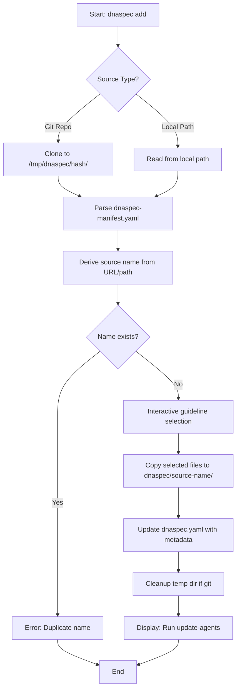
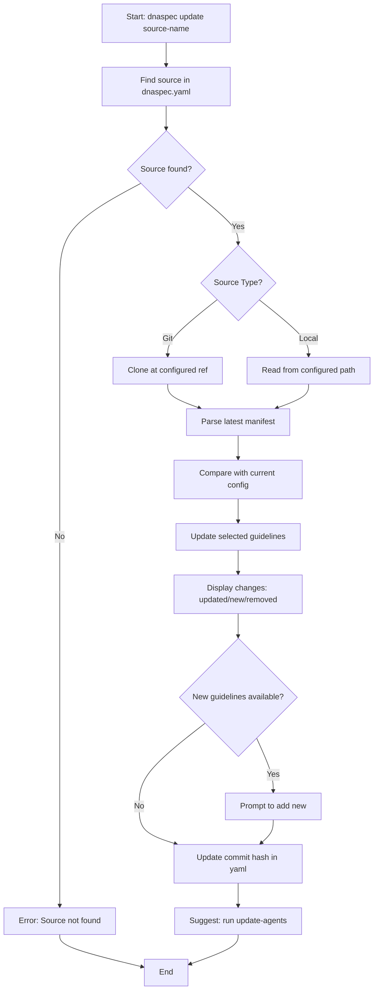
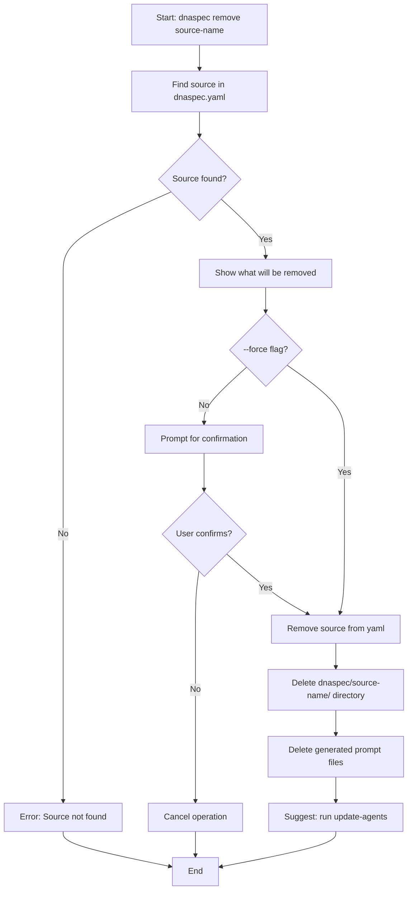
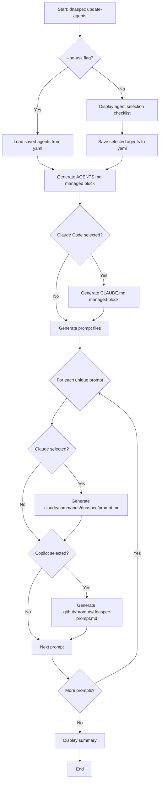
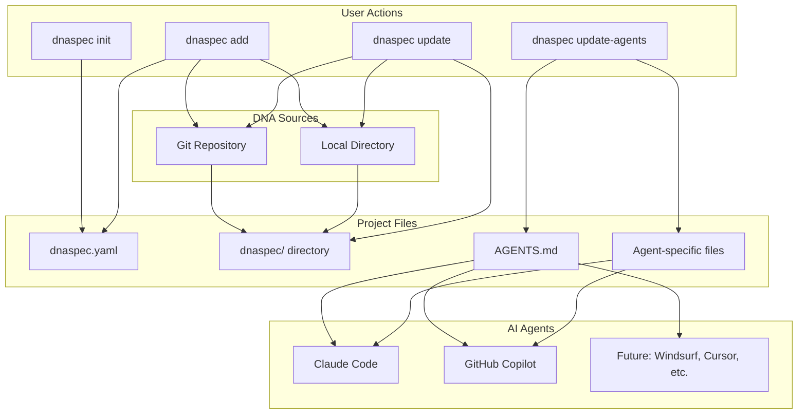

# DNASpec CLI Tool - Comprehensive Documentation

## Table of Contents

1. [Overview](#overview)
2. [Core Concepts](#core-concepts)
3. [Installation](#installation)
4. [Configuration Files](#configuration-files)
5. [Commands Reference](#commands-reference)
6. [Usage Scenarios](#usage-scenarios)
7. [Directory Structure](#directory-structure)
8. [Agent Integrations](#agent-integrations)
9. [Technical Architecture](#technical-architecture)
10. [Security Considerations](#security-considerations)
11. [Examples](#examples)

---

## Overview

### Purpose

DNASpec is a CLI tool for managing DNA (Development Norms & Architecture) guidelines across projects. It automates the distribution, integration, and maintenance of shared development guidelines from centralized repositories into any project, making them available to AI coding assistants.

### Key Features

- **Multi-source support**: Mix guidelines from different repositories
- **AI agent integration**: Auto-generate files for AI coding assistants
- **Git-based versioning**: Track DNA guidelines with git refs (tags/branches)
- **Local path support**: Work with guidelines from local filesystem
- **Incremental workflow**: Initialize empty, add sources progressively
- **Manifest validation**: Validate DNA repository structure before use

### Design Philosophy

1. **Incremental over upfront**: Start small, add as needed
2. **Explicit over automatic**: User controls what gets added/updated
3. **Simple over complex**: No drift detection, no automatic filtering

---

## Core Concepts

### DNA (Development Norms & Architecture)

DNA represents reusable development guidelines, patterns, and best practices that can be shared across multiple projects. Examples:
- Code style conventions (e.g., Go style guide, Python PEP-8)
- Architectural patterns (e.g., service layering, hexagonal architecture)
- API design guidelines (e.g., REST conventions, GraphQL best practices)
- Database design patterns (e.g., schema design, migration strategies)

### Guidelines

Individual markdown files containing specific development guidance. Each guideline has:
- **Name**: Unique identifier (spinal-case, e.g., `go-style`, `rest-api`)
- **File**: Relative path to markdown file
- **Description**: Human-readable summary
- **Applicable scenarios**: List of situations where guideline applies (used for generating AGENTS.md)
- **Prompts**: References to related prompts

Example: `go-style.md` - "Go code style conventions" - applicable when "writing new Go code" or "refactoring Go functions"

### Prompts

Reusable instructions for AI agents to perform specific tasks (e.g., code review, validation). Prompts are:
- Generic templates stored in DNA repository
- Transformed into agent-specific formats (Claude commands, Copilot prompts)
- Associated with one or more guidelines
- **Identity**: A prompt's identity is the pair `(source.name, prompt.name)`. Two prompts with the same name in different sources are independent and produce different generated files.

Example: `dna-review` prompt - "Review code against DNA guidelines"

### Sources

DNA repositories or local directories containing guidelines and prompts. Each source has:
- **Name**: Human-readable identifier (e.g., `my-company-dna`)
- **Type**: `git-repo` or `local-path`
- **Location**: Git URL + ref or filesystem path
- **Commit/Path**: Tracking information
- **Guidelines**: Selected guidelines from this source
- **Prompts**: Prompts associated with selected guidelines

### Agents

AI coding assistants that consume DNA guidelines.

**Currently Supported:**
- **Antigravity**: AI development assistant
- **Claude Code**: Anthropic's AI assistant with slash commands
- **Cursor**: AI-first code editor
- **GitHub Copilot**: GitHub's AI pair programmer
- **Windsurf**: AI-powered code editor

**Future:**
- Additional tools as ecosystem evolves

### Managed Blocks

Specially marked sections in files that DNASpec controls and updates automatically:
```markdown
<!-- DNASPEC:START -->
... auto-generated content ...
<!-- DNASPEC:END -->
```

**Customization Rules**:
- Content inside `<!-- DNASPEC:START/END -->` markers is **fully owned by DNASpec** and will be overwritten on every `update-agents` run
- Files under `dnaspec/` directory should be treated as **read-only** in the project (they are managed copies from DNA sources)
- Content **outside** the managed block markers in `AGENTS.md` and `CLAUDE.md` is preserved and can contain project-specific instructions
- For project-specific guideline variants:
  - Add separate local guideline files outside `dnaspec/` directory, OR
  - Maintain your own DNA repository and reference it as a source in `dnaspec.yaml`

---

## Installation

### Building from Source

```bash
# Clone repository
git clone https://github.com/example/dnaspec.git
cd dnaspec

# Build binary (implementation language TBD: Go or Rust)
make build

# Install to PATH (optional)
make install
```

### Requirements

- Git (for cloning DNA repositories)
- Build tools for chosen implementation language

---

## Configuration Files

### Project Configuration: `dnaspec.yaml`

Located in project root. Defines which DNA sources and guidelines are active.

**Project Root Discovery**: All project-level commands look for `dnaspec.yaml` in the current directory. If not found, they search parent directories until the filesystem root (similar to git). This allows running DNASpec commands from subdirectories within a project, and improves UX in monorepos.

```yaml
version: 1

# Selected AI agents (optional until update-agents runs)
agents:
  - "claude-code"
  - "github-copilot"

# DNA sources
sources:
  - name: "my-company-dna"          # Human-readable source name
    type: "git-repo"                # or "local-path"
    url: "https://github.com/company/dna"
    ref: "v1.2.0"                   # Git tag or branch
    commit: "abc123def456789..."    # Resolved commit hash
    subdir: "eng/dna"               # Optional: subdirectory path (for monorepos)

    # Selected guidelines from this source
    guidelines:
      - name: "go-style"            # spinal-case
        file: "guidelines/go-style.md"   # Relative to source root
        description: "Go code style conventions"
        applicable_scenarios:       # Used for generating AGENTS.md
          - "writing new Go code"
          - "refactoring existing Go code"
        prompts:                    # List of prompt names (not paths)
          - "go-style-code-review"

    # Prompts associated with selected guidelines
    prompts:
      - name: "go-style-code-review"   # spinal-case
        file: "prompts/go-style-code-review.md"
        description: "Review Go code against go-style guideline"

  - name: "api-patterns"
    type: "local-path"
    path: "shared-dna"            # Relative to project root (recommended)
    # Absolute paths work but will show warnings in 'dnaspec validate'
    guidelines: [...]
    prompts: [...]
```

**Local Path Handling**:

DNASpec stores local source paths as **relative to the project root** for portability:

- **Relative paths (recommended)**: `path: "shared-dna"` or `path: "packages/common/dna"`
  - Works on any machine where the project is checked out
  - Safe for version control
  - Validates that path stays within project directory

- **Absolute paths**: `path: "/Users/me/dna"`
  - Only works on the original machine
  - All commands work silently with absolute paths (no warnings during normal use)
  - `dnaspec validate` shows **warnings** for absolute paths (backward compatible)
  - Must be manually edited in dnaspec.yaml to convert to relative paths

**Path Outside Project Warning**:
When using `dnaspec add` with a local path outside the project directory, DNASpec shows a warning and prompts for confirmation **before** loading the source or parsing the manifest. This prevents wasted time if you decide to cancel. This is the **only** command that warns about paths - all other commands operate silently.

**Migration**: Use `dnaspec validate` to find sources with absolute paths, then manually edit `dnaspec.yaml` to convert them to relative paths.

**Monorepo Support**: The optional `subdir` field allows DNA repositories to be stored in subdirectories of larger monorepos. When `subdir` is set, DNASpec expects `dnaspec-manifest.yaml` to be located under that subdirectory within the repository or local path.

**Key Properties:**

- `version`: Configuration format version (currently 1). Breaking changes to the configuration schema will bump this number. Future versions may provide `dnaspec upgrade` to migrate configs automatically.
- `agents`: Array of enabled agent identifiers
- `sources`: Array of DNA sources with metadata
- Each source contains selected `guidelines` and `prompts`

**Naming Convention:**
- Source names: lowercase, alphanumeric + hyphens
- Guideline/prompt names: **spinal-case** (lowercase letters separated by hyphens, e.g., `go-style`, `rest-api`, `database-migrations`)

### Manifest Configuration: `dnaspec-manifest.yaml`

Located in DNA repository root. Defines available guidelines and prompts.

```yaml
version: 1

# Available guidelines in this DNA repository
guidelines:
  - name: "go-style"               # spinal-case
    file: "guidelines/go-style.md"
    description: "Go code style conventions"
    applicable_scenarios:          # IMPORTANT: Used for generating AGENTS.md
      - "writing new Go code"
      - "refactoring existing Go code"
    prompts:                       # List of prompt names (not paths) defined in the manifest's prompts section
      - "go-style-code-review"

  - name: "go-service"
    file: "guidelines/go-service.md"
    description: "Go service layering and structure"
    applicable_scenarios:
      - "designing Go services"
      - "organizing Go packages"
    prompts:
      - "go-style-code-review"

# Available prompts in this DNA repository
prompts:
  - name: "go-style-code-review"   # spinal-case
    file: "prompts/go-style-code-review.md"
    description: "Review Go code against go-style guideline"
```

**Key Properties:**

- `version`: Manifest format version
- `guidelines`: All available guidelines in repository
- `prompts`: All available prompts in repository

**Validation Rules:**
- All guideline/prompt names must be unique
- All file paths must exist
- All prompt references must exist in prompts array
- `applicable_scenarios` must not be empty (critical for AGENTS.md generation)
- Required fields: `name`, `file`, `description`

---

## Commands Reference

### `dnaspec init`

**Purpose**: Initialize empty project configuration

**Usage**:
```bash
dnaspec init
```

**Behavior**:
- Creates `dnaspec.yaml` with empty structure and commented examples
- Displays next steps: "Run 'dnaspec add' to add DNA guidelines"
- Errors if `dnaspec.yaml` already exists

**Example Output**:
```
✓ Created dnaspec.yaml

Next steps:
  1. Run 'dnaspec add --git-repo <url>' to add DNA guidelines
  2. Run 'dnaspec update-agents' to configure AI agents
```

---

### `dnaspec manifest init`

**Purpose**: Initialize DNA repository manifest

**Usage**:
```bash
dnaspec manifest init
```

**Behavior**:
- Creates `dnaspec-manifest.yaml` with example structure
- Intended for DNA repository maintainers
- Errors if `dnaspec-manifest.yaml` already exists

**Example Output**:
```
✓ Created dnaspec-manifest.yaml

Edit the manifest to define your DNA guidelines and prompts.
Run 'dnaspec manifest validate' to validate your changes.
```

---

### `dnaspec manifest validate`

**Purpose**: Validate manifest structure and references

**Usage**:
```bash
dnaspec manifest validate
```

**Behavior**:
- Reads `dnaspec-manifest.yaml`
- Validates structure, required fields, file references
- Displays errors or success message
- Exits with error code on validation failure

**Validation Checks**:
- ✓ `applicable_scenarios` not empty (required for AGENTS.md generation)
- ✓ All file references exist
- ✓ Required fields present (`name`, `description`, `file`)
- ✓ Referenced prompts exist
- ✓ No duplicate names

**Example Output**:
```
Validating dnaspec-manifest.yaml...
✓ Manifest is valid
```

or

```
Validating dnaspec-manifest.yaml...
✗ Error: Guideline 'go-style' references non-existent prompt 'missing-prompt'
✗ Error: File 'guidelines/missing.md' does not exist
✗ Error: Duplicate guideline name 'go-service'
✗ Error: Guideline 'rest-api' has empty applicable_scenarios (required for AGENTS.md)

Validation failed with 4 errors
```

---

### `dnaspec add`

**Purpose**: Add DNA guidelines from a source

**Usage**:
```bash
# Add from git repository
dnaspec add --git-repo <git-url> [--git-ref <tag-or-branch>] [--name <custom-name>] [--dry-run]

# Add from local directory (copy mode - production)
dnaspec add <local-path> [--name <custom-name>] [--dry-run]

# Add from local directory (symlink mode - development)
dnaspec add <local-path> [--name <custom-name>] --symlink [--dry-run]
```

**Options**:
- `--git-repo <url>`: Git repository URL
- `--git-ref <ref>`: Git tag or branch (default: default branch)
- `--name <name>`: Custom source name (default: auto-derived)
- `<local-path>`: Local directory path
- `--symlink`: Create symlink instead of copying files (local sources only, for development)
- `--dry-run`: Preview changes without writing files
- `--all`: Add all guidelines from the source (non-interactive)
- `--guideline <name>`: Add specific guideline by name (repeatable, non-interactive)

**Behavior**:



**Detailed Steps**:

1. **Fetch Source**:
   - Git: Clone to `/tmp/dnaspec/<url-hash>/` at specified ref
   - Local: **Early path validation** - check if path is outside project directory
     - If outside: Show warning and prompt for confirmation **before** loading source
     - If cancelled: Exit without parsing manifest (saves time)
     - If confirmed: Proceed with absolute path
   - Read from specified path

2. **Parse Manifest**:
   - Read `dnaspec-manifest.yaml`
   - Validate structure

3. **Derive Source Name**:
   - Git: Extract from repo name (e.g., `github.com/company/dna-guidelines` → `dna-guidelines`)
   - Local: Extract from directory name (e.g., `/home/user/my-patterns` → `my-patterns`)
   - Sanitize: lowercase, replace special chars with `-`, collapse consecutive `-`
   - Use `--name` if provided

4. **Check for Duplicates**:
   - Error if source name already exists
   - Suggest using `--name` flag

5. **Guideline Selection**:
   - **Interactive mode** (default when no flags provided):
     - Display checklist of ALL available guidelines
     - Show: name, description, applicable_scenarios
     - User selects which to add
   - **Non-interactive mode** (when `--all` or `--guideline` flags provided):
     - `--all`: Automatically add all guidelines from the source
     - `--guideline <name>`: Add only specified guidelines (can be repeated)
     - Error if specified guideline name doesn't exist in manifest

6. **Copy or Symlink Files**:
   - **Copy mode** (default for production):
     - Copy selected guidelines to `dnaspec/<source-name>/guidelines/`
     - Copy associated prompts to `dnaspec/<source-name>/prompts/`
     - Preserve relative paths from manifest
   - **Symlink mode** (--symlink, local sources only, for development):
     - Create symlink: `dnaspec/<source-name>/` → source path
     - Changes in source directory instantly reflected
     - Record `symlinked: true` in config
     - Warn if committing to git (path won't exist on other machines)

7. **Update Configuration**:
   - Add source entry to `dnaspec.yaml`
   - Record metadata (type, url/path, ref, commit, guidelines, prompts)

8. **Cleanup**:
   - Remove temp directory (git only)

9. **Display Next Steps**:
   - "Run 'dnaspec update-agents' to configure AI agents"

**Examples**:
```bash
# Add from GitHub repository
dnaspec add --git-repo https://github.com/company/dna-guidelines

# Add specific version
dnaspec add --git-repo https://github.com/company/dna --git-ref v1.2.0

# Add with custom name
dnaspec add --git-repo https://github.com/company/dna --name company-dna

# Add from local directory (inside project - uses relative path)
dnaspec add ./shared/dna

# Add from local directory (outside project - shows early warning)
dnaspec add /Users/me/external-dna
# ⚠ Warning: Local source is outside project directory
#   Project: /Users/me/myproject
#   Source: /Users/me/external-dna
#
# This absolute path won't work on other machines.
# Consider moving the source into your project directory.
#
# Continue with absolute path? (y/N):

# Add local with custom name
dnaspec add ./dna --name my-patterns

# Add local with symlink (development mode)
dnaspec add /Users/me/my-dna --name experimental --symlink

# Preview what would be added
dnaspec add --git-repo https://github.com/company/dna --dry-run

# Non-interactive: Add all guidelines
dnaspec add --git-repo https://github.com/company/dna --git-ref v1.2.0 --all

# Non-interactive: Add specific guidelines
dnaspec add --git-repo https://github.com/company/dna --guideline go-style --guideline rest-api
```

**Output**:
```
Cloning https://github.com/company/dna-guidelines...
✓ Cloned repository (commit: abc123de)

Source name: dna-guidelines

Select guidelines to add:
[ ] go-style - Go code style conventions
[ ] go-service - Go service layering and structure
[x] rest-api - REST API design guidelines
[ ] database - Database design patterns

✓ Copied 1 guideline and 1 prompt to dnaspec/dna-guidelines/
✓ Updated dnaspec.yaml

Next steps:
  Run 'dnaspec update-agents' to configure AI agents
```

---

### `dnaspec update`

**Purpose**: Update source(s) from their origin

**Usage**:
```bash
# Update specific source
dnaspec update <source-name> [--dry-run]

# Update all sources
dnaspec update --all [--dry-run]
```

**Options**:
- `<source-name>`: Name of source to update (required unless --all)
- `--all`: Update all sources
- `--dry-run`: Preview changes without writing files
- `--add-new=<policy>`: Control automatic addition of new guidelines
  - `all`: Automatically add all newly discovered guidelines (non-interactive)
  - `none`: Never add new guidelines, only update existing (non-interactive)
  - Omit this flag for interactive prompt (default behavior)

**Behavior**:



**Detailed Steps**:

1. **Find Source**: Look up source by name in `dnaspec.yaml`
2. **Fetch Latest**: Clone (git) or read (local) from configured location
3. **Parse Manifest**: Read latest `dnaspec-manifest.yaml`
4. **Compare**: Detect updated, new, and removed guidelines
5. **Update Selected Guidelines**: Copy latest files, overwrite existing (no drift detection)
6. **Report Changes**: Display what changed
7. **Handle New Guidelines**:
   - **Interactive mode** (default when `--add-new` not specified):
     - Prompt user to add newly available guidelines
   - **Non-interactive mode** (`--add-new` flag provided):
     - `--add-new=all`: Automatically add all new guidelines
     - `--add-new=none`: Skip new guidelines, only update existing
8. **Update Metadata**: Update commit hash (git) in `dnaspec.yaml`
9. **Suggest Next Steps**: "Run 'dnaspec update-agents' to regenerate agent files"

**Examples**:
```bash
# Update specific source
dnaspec update my-company-dna

# Update all sources
dnaspec update --all

# Preview updates without applying
dnaspec update my-company-dna --dry-run

# Non-interactive: Auto-add all new guidelines
dnaspec update my-company-dna --add-new=all

# Non-interactive: Only update existing, don't add new
dnaspec update my-company-dna --add-new=none
```

**Output**:
```
Fetching latest from https://github.com/company/dna...
✓ Current commit: abc123de
✓ Latest commit: def456ab (changed)

Updated guidelines:
  ✓ go-style (description changed)
  ✓ rest-api (content updated)

New guidelines available:
  - go-testing - Go testing patterns
  - go-errors - Error handling conventions

Removed from source:
  - old-guideline (no longer in manifest)

Add new guidelines? [y/N]: n

✓ Updated dnaspec.yaml

Run 'dnaspec update-agents' to regenerate agent files
```

---

### `dnaspec remove`

**Purpose**: Remove a DNA source from the project

**Usage**:
```bash
dnaspec remove <source-name> [--force]
```

**Options**:
- `<source-name>`: Name of the source to remove (required)
- `--force`: Skip confirmation prompt

**Behavior**:



**Detailed Steps**:

1. **Find Source**: Look up source by name in `dnaspec.yaml`
2. **Display Impact**: Show what will be removed:
   - Source entry in dnaspec.yaml
   - Files in `dnaspec/<source-name>/` directory
   - Generated agent files for all supported agents:
     - Antigravity: `.agent/workflows/dnaspec-<source-name>-*.md`
     - Claude Code: `.claude/commands/dnaspec/<source-name>-*.md`
     - Cursor: `.cursor/commands/dnaspec-<source-name>-*.md`
     - GitHub Copilot: `.github/prompts/dnaspec-<source-name>-*.prompt.md`
     - Windsurf: `.windsurf/workflows/dnaspec-<source-name>-*.md`
3. **Confirm** (unless `--force`): Prompt user to confirm deletion
4. **Remove Files**: Delete source directory and generated agent files
5. **Update Config**: Remove source entry from `dnaspec.yaml`
6. **Suggest Next Steps**: Recommend running `dnaspec update-agents` to regenerate AGENTS.md

**Examples**:
```bash
# Remove with confirmation
dnaspec remove experimental

# Remove without confirmation
dnaspec remove experimental --force
```

**Output**:
```
Removing source 'experimental'...

The following will be deleted:
  - dnaspec.yaml entry for 'experimental'
  - dnaspec/experimental/ directory (2 guidelines, 1 prompt)
  - .claude/commands/dnaspec/experimental-review.md
  - .github/prompts/dnaspec-experimental-review.prompt.md

This cannot be undone. Continue? [y/N]: y

✓ Removed source 'experimental'
✓ Cleaned up 4 files

Run 'dnaspec update-agents' to regenerate agent files
```

---

### `dnaspec update-agents`

**Purpose**: Configure AI agents and regenerate agent files

**Usage**:
```bash
# Interactive: prompt for agent selection
dnaspec update-agents

# Non-interactive: use saved selection
dnaspec update-agents --no-ask
```

**Options**:
- `--no-ask`: Skip agent selection, use saved configuration

**Behavior**:



**Detailed Steps**:

1. **Agent Selection** (if not `--no-ask`):
   - Display agent list: Claude Code, GitHub Copilot (Phase 1)
   - Show currently selected agents as checked
   - Allow multi-select
   - Save selection to `dnaspec.yaml` `agents` array

2. **Generate Managed Blocks**:
   - **CRITICAL**: Use `applicable_scenarios` from each guideline to generate context-aware instructions
   - Update `AGENTS.md` with guideline references and their applicable scenarios
   - Update `CLAUDE.md` if Claude selected (same content as AGENTS.md)
   - Use format: `@/dnaspec/<source-name>/<file>` for guidelines
   - List applicable scenarios as bullets under each guideline

   **File Creation Rules**:
   - If `AGENTS.md` or `CLAUDE.md` does not exist: Create it with only the managed block and a short header
   - If file exists but has no `<!-- DNASPEC:START/END -->` block: Append the managed block at the end of the file
   - If managed block exists: Replace only the content between the markers, preserving all content outside the markers

3. **Generate Prompt Files**:
   - For each prompt in each source (unique pair of source name and prompt name):
     - Generate Claude command if Claude selected
     - Generate Copilot prompt if Copilot selected
   - Filenames include source name to prevent collisions: `<source-name>-<prompt-name>`
   - Overwrite existing files

4. **Claude Integration**:
   - Create `.claude/commands/dnaspec/<source-name>-<prompt-name>.md`
   - Frontmatter: name, description, category, tags
   - Wrap content in `<!-- DNASPEC:START/END -->`

5. **Copilot Integration**:
   - Create `.github/prompts/dnaspec-<source-name>-<prompt-name>.prompt.md`
   - Frontmatter: description
   - Include `$ARGUMENTS` placeholder
   - Wrap content in `<!-- DNASPEC:START/END -->`

**Examples**:
```bash
# First time setup
dnaspec update-agents

# Regenerate after adding guidelines
dnaspec update-agents

# Regenerate without prompts
dnaspec update-agents --no-ask
```

**Output**:
```
Select AI agents (Phase 1):
[x] Claude Code
[x] GitHub Copilot

✓ Updated dnaspec.yaml

Generating agent files...
  ✓ AGENTS.md (with applicable_scenarios from guidelines)
  ✓ CLAUDE.md
  ✓ .claude/commands/dnaspec/go-style-code-review.md
  ✓ .github/prompts/dnaspec-go-style-code-review.prompt.md

✓ Agent files generated
```

---

### `dnaspec list`

**Purpose**: Display configured sources, guidelines, and agents

**Usage**:
```bash
dnaspec list
```

**Behavior**:
- Read `dnaspec.yaml`
- Display all sources with names and types
- Display guidelines per source
- Display prompts per source
- Display configured agents

**Example Output**:
```
Configured Agents (Phase 1):
  - Claude Code
  - GitHub Copilot

Sources:

my-company-dna (git-repo)
  URL: https://github.com/company/dna
  Ref: v1.2.0
  Commit: abc123de

  Guidelines:
    - go-style: Go code style conventions
    - rest-api: REST API design guidelines

  Prompts:
    - go-style-code-review: Review Go code against go-style guideline

api-patterns (local-path)
  Path: shared-dna/api-patterns (relative to project root)

  Guidelines:
    - rest-best-practices: REST API best practices

  Prompts:
    - api-review: Review API design
```

---

### `dnaspec validate`

**Purpose**: Validate project configuration

**Usage**:
```bash
dnaspec validate
```

**Behavior**:
- Read and parse `dnaspec.yaml`
- Validate YAML syntax and schema
- Check all file references exist
- Verify agent IDs are recognized
- Check for symlinked sources with missing paths (warning only)
- **Warn about absolute paths** in local-path sources (backward compatible)
- Display errors, warnings, or success message
- Exit with error code only if validation errors found (warnings don't fail)

**Validation Checks**:
- ✓ YAML syntax valid
- ✓ Config version supported (currently 1)
- ✓ All sources have required fields (errors on missing fields)
- ✓ All referenced files exist in `dnaspec/` directory (errors on missing files)
- ✓ Agent IDs are recognized (errors on unknown agents)
- ✓ No duplicate source names (errors on duplicates)
- ⚠ **Warning** for absolute paths in local-path sources (use `dnaspec update <source>` to fix)
- ⚠ Warning for symlinked sources with missing target paths (warning only, doesn't fail)

**Example Output (Success)**:
```
Validating dnaspec.yaml...
✓ YAML syntax valid
✓ Version 1 schema valid
✓ 2 sources configured
✓ All referenced files exist:
  - dnaspec/company-dna/guidelines/go-style.md
  - dnaspec/company-dna/guidelines/rest-api.md
  - dnaspec/company-dna/prompts/code-review.md
  - dnaspec/team-patterns/guidelines/service-arch.md
  - dnaspec/team-patterns/prompts/arch-review.md
✓ All agent IDs recognized: claude-code, github-copilot
✓ Configuration is valid
```

**Example Output (Errors)**:
```
Validating dnaspec.yaml...
✓ YAML syntax valid
✗ Error: File not found: dnaspec/company-dna/guidelines/missing.md
✗ Error: Unknown agent ID: 'invalid-agent'
✗ Error: Source 'team-patterns' missing required field: path

Validation failed with 3 errors
```

**Example Output (With Warnings)**:
```
Validating dnaspec.yaml...
✓ YAML syntax valid
✓ Version 1 schema valid
✓ 2 sources configured
✓ All referenced files exist:
  - dnaspec/experimental/guidelines/pattern.md

⚠ Found 1 warning(s):
  - Source 'experimental' uses absolute path: /Users/me/external/dna
    Consider manually editing dnaspec.yaml to use a relative path

✓ Configuration is valid (with warnings)
```

**Note**: Warnings don't fail validation, only errors do. Configuration passes validation even with warnings.

---

### `dnaspec sync`

**Purpose**: Update all sources and regenerate agent files (convenience command)

**Usage**:
```bash
dnaspec sync [--dry-run]
```

**Options**:
- `--dry-run`: Preview what would change without writing files

**Behavior**:
1. Update all sources (equivalent to `dnaspec update --all`)
2. Regenerate agent files (equivalent to `dnaspec update-agents --no-ask`)
3. Display summary of changes

**Note**: `dnaspec sync` is designed to be non-interactive and safe for CI pipelines. It uses saved agent configurations and does not prompt for user input.

**Equivalent To**:
```bash
dnaspec update --all
dnaspec update-agents --no-ask
```

**Example Output**:
```
Syncing all DNA sources...

Updating company-dna...
✓ No changes (already at latest commit)

Updating team-patterns...
✓ Updated 2 guidelines
✓ No new guidelines available

Regenerating agent files...
✓ AGENTS.md
✓ CLAUDE.md
✓ 2 Claude commands
✓ 2 Copilot prompts

✓ Sync complete
```

---

## Usage Scenarios

### Scenario 1: Setting up a new project

```bash
# 1. Initialize project configuration
dnaspec init

# 2. Add DNA guidelines from company repo
dnaspec add --git-repo https://github.com/company/dna-guidelines --git-ref v1.0.0

# (Interactive: select guidelines)

# 3. Configure AI agents
dnaspec update-agents

# (Interactive: select Claude Code, GitHub Copilot)

# 4. Commit to version control
git add dnaspec.yaml dnaspec/ AGENTS.md CLAUDE.md .claude/ .github/
git commit -m "Add DNA guidelines"
```

### Scenario 2: Adding guidelines from multiple sources

```bash
# Add company-wide guidelines
dnaspec add --git-repo https://github.com/company/dna --name company

# Add team-specific patterns
dnaspec add --git-repo https://github.com/team/patterns --name team

# Add local experimental guidelines
dnaspec add /Users/me/experimental-dna --name experimental

# Update agent files
dnaspec update-agents --no-ask
```

### Scenario 3: Updating to latest guidelines

```bash
# Option 1: Update specific source
dnaspec update company
# (Shows changes, prompts for new guidelines)
dnaspec update-agents --no-ask

# Option 2: Update all sources
dnaspec update --all
dnaspec update-agents --no-ask

# Option 3: Sync everything (update all + regenerate agents)
dnaspec sync

# Commit changes
git add dnaspec.yaml dnaspec/ AGENTS.md CLAUDE.md .claude/ .github/
git commit -m "Update DNA guidelines to latest"
```

### Scenario 4: Creating a DNA repository

```bash
# In DNA repository root
dnaspec manifest init

# Edit dnaspec-manifest.yaml
# - Add guidelines with files, descriptions, scenarios
# - Add prompts with files, descriptions
# - Reference prompts from guidelines
# - IMPORTANT: Ensure applicable_scenarios are comprehensive (used for AGENTS.md)

# Validate manifest
dnaspec manifest validate

# Commit
git add dnaspec-manifest.yaml guidelines/ prompts/
git commit -m "Add DNA manifest"
git tag v1.0.0
git push --tags
```

### Scenario 5: Working with local DNA during development

```bash
# Developer is creating new guidelines locally
cd ~/my-dna
dnaspec manifest init
# ... create guidelines and prompts ...
dnaspec manifest validate

# Test in project with symlink (development mode)
cd ~/my-project
dnaspec add ~/my-dna --name my-experimental-dna --symlink
dnaspec update-agents --no-ask

# Iterate: edit guidelines - changes reflect immediately via symlink!
cd ~/my-dna
# ... edit guideline files ...
cd ~/my-project
# No need to run update - files already reflect changes!

# When ready, push DNA to git and switch to git source
cd ~/my-dna
git remote add origin https://github.com/me/my-dna
git push -u origin main

cd ~/my-project
# Remove symlinked source, add git source
dnaspec remove my-experimental-dna
dnaspec add --git-repo https://github.com/me/my-dna --name my-dna
dnaspec update-agents --no-ask
```

---

## Directory Structure

### Project Structure

```
my-project/
├── dnaspec.yaml                          # Project configuration
├── dnaspec/                              # DNA guidelines (committed to git)
│   ├── company-dna/                      # Source name (namespace)
│   │   ├── guidelines/
│   │   │   ├── go-style.md
│   │   │   └── rest-api.md
│   │   └── prompts/
│   │       └── code-review.md
│   └── team-patterns/                    # Source name (namespace)
│       ├── guidelines/
│       │   └── service-arch.md
│       └── prompts/
│           └── arch-review.md
├── AGENTS.md                             # Managed block with guideline refs
├── CLAUDE.md                             # Managed block (if Claude enabled)
├── .claude/
│   └── commands/
│       └── dnaspec/                      # Generated Claude commands (namespaced)
│           ├── company-dna-code-review.md
│           └── team-patterns-arch-review.md
└── .github/
    └── prompts/                          # Generated Copilot prompts (namespaced)
        ├── dnaspec-company-dna-code-review.prompt.md
        └── dnaspec-team-patterns-arch-review.prompt.md
```

**Note**: Source names act as namespaces, preventing conflicts when multiple sources have guidelines with the same name.

### DNA Repository Structure

```
dna-guidelines/
├── dnaspec-manifest.yaml                 # Manifest configuration
├── guidelines/                           # Guideline markdown files
│   ├── go-style.md
│   ├── go-service.md
│   ├── rest-api.md
│   └── database.md
└── prompts/                              # Prompt templates
    ├── go-code-review.md
    └── api-review.md
```

---

## Agent Integrations

### Claude Code

**Generated Files**:

1. **AGENTS.md** (managed block):

**CRITICAL**: The managed block uses `applicable_scenarios` from each guideline to provide context-aware instructions to AI agents.

```markdown
<!-- DNASPEC:START -->
## DNASpec Instructions

The project MUST follow shared DNA (Development Norms & Architecture) guidelines stored in the `@/dnaspec` directory. DNA contains reusable patterns and best practices applicable across different projects.

These instructions are for AI assistants working in this project.

When working on the codebase, open and refer to the following DNA guidelines as needed:
- `@/dnaspec/company-dna/guidelines/go-style.md` for
   * writing new Go code
   * refactoring existing Go code
- `@/dnaspec/company-dna/guidelines/rest-api.md` for
   * designing API endpoints
   * implementing HTTP handlers

Keep this managed block so 'dnaspec update-agents' can refresh the instructions.

You can add custom project-specific instructions anywhere outside the managed block markers.
<!-- DNASPEC:END -->
```

**Note**:
- The bullets under each guideline path come directly from the `applicable_scenarios` field in the manifest. This is crucial for AI agents to know when to consult each guideline.
- Paths include the source name as a namespace (`company-dna/guidelines/...`), preventing conflicts when multiple sources have guidelines with the same name.
- Users can add custom content outside the `<!-- DNASPEC:START/END -->` markers, which will be preserved across updates.

2. **CLAUDE.md** (managed block):
Same content as AGENTS.md

3. **.claude/commands/dnaspec/<source-name>-<prompt-name>.md**:
```markdown
---
name: DNASpec: Company DNA Go Code Review
description: Review Go code against go-style DNA guideline
category: DNASpec
tags: [dnaspec, "company-dna-go-code-review"]
---
<!-- DNASPEC:START -->
Review the selected Go code against the go-style DNA guideline located at `@/dnaspec/company-dna/guidelines/go-style.md`.

Check for:
- Code style compliance
- Naming conventions
- Error handling patterns
- ...
<!-- DNASPEC:END -->
```

**Usage**:
```bash
# AI assistant reads CLAUDE.md instructions
# User can invoke slash commands
/dnaspec-company-dna-go-code-review <file>
```

### GitHub Copilot

**Generated Files**:

1. **AGENTS.md** (managed block):
Same as Claude Code

2. **.github/prompts/dnaspec-<source-name>-<prompt-name>.prompt.md**:
```markdown
---
description: Review Go code against go-style DNA guideline
---

$ARGUMENTS
<!-- DNASPEC:START -->
Review the code against the go-style DNA guideline.

Check for:
- Code style compliance
- Naming conventions
- Error handling patterns
- ...
<!-- DNASPEC:END -->
```

**Usage**:
GitHub Copilot reads prompts automatically and can be invoked via Copilot chat.

### Antigravity

**Generated Files**:

1. **AGENTS.md** (managed block):
Same as Claude Code and GitHub Copilot

2. **.agent/workflows/dnaspec-<source-name>-<prompt-name>.md**:
```markdown
---
description: Review Go code against go-style DNA guideline
---
<!-- DNASPEC:START -->
Review the code against the go-style DNA guideline.

Check for:
- Code style compliance
- Naming conventions
- Error handling patterns
- ...
<!-- DNASPEC:END -->
```

**Usage**:
Antigravity reads workflow files from `.agent/workflows/` directory.

### Windsurf

**Generated Files**:

1. **AGENTS.md** (managed block):
Same as other agents

2. **.windsurf/workflows/dnaspec-<source-name>-<prompt-name>.md**:
```markdown
---
description: Review Go code against go-style DNA guideline
auto_execution_mode: 3
---
<!-- DNASPEC:START -->
Review the code against the go-style DNA guideline.

Check for:
- Code style compliance
- Naming conventions
- Error handling patterns
- ...
<!-- DNASPEC:END -->
```

**Usage**:
Windsurf reads workflow files from `.windsurf/workflows/` directory with auto-execution enabled.

### Cursor

**Generated Files**:

1. **AGENTS.md** (managed block):
Same as other agents

2. **.cursor/commands/dnaspec-<source-name>-<prompt-name>.md**:
```markdown
---
name: /dnaspec-company-dna-go-code-review
id: dnaspec-company-dna-go-code-review
category: DNASpec
description: Review Go code against go-style DNA guideline
---
<!-- DNASPEC:START -->
Review the code against the go-style DNA guideline.

Check for:
- Code style compliance
- Naming conventions
- Error handling patterns
- ...
<!-- DNASPEC:END -->
```

**Usage**:
Cursor reads command files from `.cursor/commands/` directory and makes them available as slash commands.

### Future Agent Support

Additional AI tools can be integrated as the ecosystem evolves. Each new agent will have its own integration pattern, but all will consume the same DNA guidelines and prompts.

### Agent Abstraction

Internally, each agent implements a common interface that takes configuration, guidelines, and prompts as inputs and produces agent-specific generated files as output. The `update-agents` command iterates over the selected agents and delegates to these agent-specific generators. This design ensures that adding new agent integrations doesn't require changes to core DNASpec logic—only a new agent generator module is needed.

---

## Technical Architecture

### System Overview



### Architecture Boundaries

Internally, the implementation should separate these conceptual layers:

**Core Domain:**
- Configuration management (dnaspec.yaml, dnaspec-manifest.yaml)
- Domain entities (sources, guidelines, prompts, manifests)
- Schema definitions and templates
- Validation logic (manifest validation, path security, naming conventions)
- Source name derivation and normalization

**CLI / UI Layer:**
- Command parsing and flag handling
- User interaction (prompts, confirmations)
- Terminal output formatting (colors, icons, progress indicators)
- Help text and usage examples
- Exit code management

**Agent Adapters:**
- Mapping core data into agent-specific file formats
- Claude Code integration (CLAUDE.md, .claude/commands/)
- GitHub Copilot integration (.github/prompts/)
- Future agent integrations (Windsurf, Cursor, etc.)
- Managing agent-specific file locations and formats

**Repository Access Layer:**
- Git repository cloning and checkout
- Local directory access
- Temporary directory management (creation, cleanup)
- Security validation (URL validation, path traversal prevention)
- File operations (copy, symlink, atomic writes)

### File Operations Best Practices

#### Atomic Writes

To ensure robustness and prevent corrupted files from interrupted operations, all writes to critical files should be atomic:

**Files requiring atomic writes**:
- `dnaspec.yaml` (project configuration)
- `AGENTS.md` and `CLAUDE.md` (managed blocks)
- Generated prompt files (`.claude/commands/dnaspec/*.md`, `.github/prompts/*.prompt.md`)

**Implementation**:
1. Write content to a temporary file in the same directory (e.g., `dnaspec.yaml.tmp`)
2. On successful write, atomically rename the temp file to the target filename
3. The `rename()` system call is atomic on all major filesystems

This approach prevents half-written files if the process crashes or is interrupted mid-write.

#### Clone Caching (Future Optimization)

Currently, DNASpec clones git repositories to temporary directories and deletes them after use. For large DNA repositories and frequent operations, a caching strategy would improve performance:

**Future design**:
- Cache cloned repositories under a user-level cache directory (e.g., `~/.cache/dnaspec/<url-hash>/`)
- Use `git fetch` + `checkout` instead of cloning from scratch on subsequent operations
- Implement cache expiration and cleanup policies
- Add `dnaspec cache clean` command to manually clear cache

This optimization is not required for the initial implementation but is noted here for future consideration.

### Key Algorithms

#### Source Name Derivation

**Purpose**: Convert git URL or local path into human-readable source name

**Algorithm**:
```
function derive_source_name(git_url, local_path):
    if git_url is not empty:
        // Extract from URL
        // https://github.com/company/dna-guidelines.git -> dna-guidelines
        // git@github.com:company/dna.git -> dna
        raw = extract_repo_name(git_url)
    else:
        // Extract from path
        // /home/user/my-patterns -> my-patterns
        // ./local-dna -> local-dna
        raw = basename(local_path)

    return sanitize_name(raw)

function sanitize_name(name):
    // Convert to lowercase
    name = to_lowercase(name)

    // Replace spaces and special chars with hyphens
    name = replace_non_alphanumeric(name, "-")

    // Remove leading/trailing hyphens
    name = trim(name, "-")

    // Collapse consecutive hyphens
    name = collapse_hyphens(name)

    return name
```

**Examples**:
- `https://github.com/company/dna-guidelines.git` → `dna-guidelines`
- `/Users/me/My DNA Patterns` → `my-dna-patterns`
- `./local_dna!!!` → `local-dna`

#### Manifest Validation

**Purpose**: Validate DNA repository manifest structure and references

**Algorithm**:
```
function validate_manifest(manifest):
    errors = []

    // Check required fields
    for each guideline in manifest.guidelines:
        if guideline.name is empty:
            errors.append("guideline missing name")

        if guideline.description is empty:
            errors.append("guideline '{name}' missing description")

        if guideline.applicable_scenarios is empty:
            errors.append("guideline '{name}' has empty applicable_scenarios (required for AGENTS.md)")

        if not file_exists(guideline.file):
            errors.append("guideline '{name}' file not found: {file}")

    // Check prompt references
    prompt_map = create_map_from(manifest.prompts)

    for each prompt in manifest.prompts:
        if not file_exists(prompt.file):
            errors.append("prompt '{name}' file not found: {file}")

    for each guideline in manifest.guidelines:
        for each prompt_ref in guideline.prompts:
            if prompt_ref not in prompt_map:
                errors.append("guideline '{name}' references non-existent prompt '{prompt_ref}'")

    // Check for duplicates
    names = set()
    for each guideline in manifest.guidelines:
        if guideline.name in names:
            errors.append("duplicate guideline name: {name}")
        names.add(guideline.name)

    return errors
```

#### Managed Block Generation

**Purpose**: Generate AGENTS.md content using applicable_scenarios from guidelines

**Algorithm**:
```
function generate_managed_block_content(config):
    content = ""

    content += "## DNASpec Instructions\n\n"
    content += "The project MUST follow shared DNA (Development Norms & Architecture) "
    content += "guidelines stored in the `@/dnaspec` directory. DNA contains reusable "
    content += "patterns and best practices applicable across different projects.\n\n"
    content += "These instructions are for AI assistants working in this project.\n\n"
    content += "When working on the codebase, open and refer to the following DNA guidelines as needed:\n"

    for each source in config.sources:
        for each guideline in source.guidelines:
            // Format: @/dnaspec/<source-name>/<file>
            path = "@/dnaspec/{source.name}/{guideline.file}"
            content += "- `{path}` for\n"

            // CRITICAL: Use applicable_scenarios to provide context
            for each scenario in guideline.applicable_scenarios:
                content += "   * {scenario}\n"

    content += "\nKeep this managed block so 'dnaspec update-agents' can refresh the instructions.\n"

    return content
```

**Example Output**:
```markdown
- `@/dnaspec/company-dna/guidelines/go-style.md` for
   * writing new Go code
   * refactoring existing Go code
- `@/dnaspec/company-dna/guidelines/rest-api.md` for
   * designing API endpoints
   * implementing HTTP handlers
```

#### Update Source Logic

**Purpose**: Update a specific source from its origin

**Algorithm**:
```
function update_source(config, source_name):
    // Find source
    source = find_source_by_name(config, source_name)
    if source is null:
        return error("source '{source_name}' not found")

    // Fetch latest manifest
    if source.type == "git-repo":
        temp_dir = clone_to_temp(source.url, source.ref)
        manifest = read_manifest(temp_dir + "/dnaspec-manifest.yaml")
        new_commit = get_commit_hash(temp_dir)

        if new_commit == source.commit:
            print("Source is up to date")
            return

        print("Updating from {source.commit[:8]} to {new_commit[:8]}")
    else:
        // Local path
        manifest = read_manifest(source.path + "/dnaspec-manifest.yaml")

    // Update selected guidelines
    for each guideline in source.guidelines:
        // Find in manifest
        manifest_guideline = find_guideline(manifest, guideline.name)

        if manifest_guideline is null:
            print("Warning: guideline '{guideline.name}' removed from source")
            continue

        // Update metadata
        guideline.description = manifest_guideline.description
        guideline.applicable_scenarios = manifest_guideline.applicable_scenarios
        guideline.prompts = manifest_guideline.prompts

        // Copy file
        src_path = temp_dir + "/" + manifest_guideline.file
        dest_path = "dnaspec/{source.name}/{manifest_guideline.file}"
        copy_file(src_path, dest_path)

        print("✓ Updated {guideline.name}")

    // Update commit
    if source.type == "git-repo":
        source.commit = new_commit

    // Save config
    write_config(config)

    // Cleanup
    if temp_dir:
        remove_directory(temp_dir)
```

### Data Structures

**Project Configuration**:
```
Config:
    version: integer
    agents: list of string
    sources: list of Source

Source:
    name: string
    type: string ("git-repo" or "local-path")
    url: string (optional, for git-repo)
    ref: string (optional, for git-repo)
    commit: string (optional, for git-repo)
    path: string (optional, for local-path)
    symlinked: boolean (optional, for local-path, indicates symlink mode)
    subdir: string (optional, subdirectory path within repo/path for monorepo support)
    guidelines: list of Guideline
    prompts: list of Prompt

Guideline:
    name: string (spinal-case)
    file: string (relative path)
    description: string
    applicable_scenarios: list of string (CRITICAL for AGENTS.md)
    prompts: list of string (references to prompt names)

Prompt:
    name: string (spinal-case)
    file: string (relative path)
    description: string
```

**Manifest Configuration**:
```
Manifest:
    version: integer
    guidelines: list of ManifestGuideline
    prompts: list of ManifestPrompt

ManifestGuideline:
    name: string (spinal-case)
    file: string (relative path)
    description: string
    applicable_scenarios: list of string (REQUIRED)
    prompts: list of string

ManifestPrompt:
    name: string (spinal-case)
    file: string (relative path)
    description: string
```

---

## Security Considerations

### Path Traversal Protection

**Threat**: Malicious manifest files could reference paths outside intended directories

**Attack Vector**:
```yaml
# Malicious dnaspec-manifest.yaml
guidelines:
  - name: "evil"
    file: "../../../etc/passwd"  # Path traversal attack!
```

**Mitigation**:
```
Path validation rules enforced during manifest parsing:
1. ✓ Paths must be relative (no absolute paths like /etc/passwd)
2. ✓ No path traversal (no ".." components)
3. ✓ Paths must be within expected directories (guidelines/ or prompts/)
4. ✓ Paths are sanitized before file operations

Implementation:
- Validate all paths in manifest before copying files
- Use filepath.Clean() to normalize paths
- Reject any path that doesn't start with "guidelines/" or "prompts/"
```

### Local Path Security

**Threat**: Local sources could reference paths outside the project directory

**Mitigation**:

1. **Relative Paths (Recommended)**:
   - Store paths relative to project root for portability
   - Validate that paths stay within project directory
   - Automatically convert absolute to relative when possible

2. **Early Warning for External Paths**:
   - When adding local source outside project, show warning **before** loading source
   - Require explicit user confirmation to proceed
   - Saves time by not loading manifest if user cancels
   - Only command that shows path warnings

3. **Validation Warnings**:
   - `dnaspec validate` shows **warnings** for absolute paths (backward compatible)
   - Suggests manually editing dnaspec.yaml to use relative paths
   - Doesn't fail validation, maintains backward compatibility

4. **Auto-Migration**:
   - `dnaspec update` automatically converts absolute to relative when possible
   - Only for paths within project directory
   - External paths silently kept absolute (caught by validate)

**Example Validation**:
```go
func validateManifestPath(path string) error {
    // Must be relative
    if filepath.IsAbs(path) {
        return fmt.Errorf("absolute paths not allowed: %s", path)
    }

    // No path traversal
    if strings.Contains(path, "..") {
        return fmt.Errorf("path traversal not allowed: %s", path)
    }

    // Must be within expected directories
    clean := filepath.Clean(path)
    if !strings.HasPrefix(clean, "guidelines/") &&
       !strings.HasPrefix(clean, "prompts/") {
        return fmt.Errorf("path must be within guidelines/ or prompts/: %s", path)
    }

    return nil
}
```

### Git Clone Safety

**Threats**:
- Man-in-the-middle attacks during clone
- Malicious repository URLs
- Denial of service via large repositories

**Mitigations**:

1. **URL Validation**:
```
✓ Only allow https:// and git@ URLs (SSH)
✓ Reject insecure git:// protocol
✓ Validate URL format before cloning
✓ Optional: allowlist trusted domains
```

2. **Clone Timeout**:
```
✓ Set maximum clone timeout (5 minutes)
✓ Use context.WithTimeout for all git operations
✓ Prevent DoS from extremely large repos
```

3. **Shallow Clones**:
```
✓ Use --depth=1 for faster clones
✓ Reduces bandwidth and disk usage
✓ Only downloads specified ref (tag/branch)
```

4. **Post-Clone Validation**:
```
✓ Verify dnaspec-manifest.yaml exists
✓ Validate manifest before processing files
✓ Check file paths before copying
```

**Example**:
```go
func validateGitURL(url string) error {
    // Only allow https:// and git@ URLs
    if !strings.HasPrefix(url, "https://") &&
       !strings.HasPrefix(url, "git@") {
        return fmt.Errorf("only HTTPS and SSH URLs supported")
    }

    // Reject git:// protocol (insecure)
    if strings.HasPrefix(url, "git://") {
        return fmt.Errorf("git:// protocol not allowed")
    }

    return nil
}

func cloneRepo(url, ref string, tempDir string) (commit string, err error) {
    // Validate URL
    if err := validateGitURL(url); err != nil {
        return "", err
    }

    // Create timeout context
    ctx, cancel := context.WithTimeout(context.Background(), 5*time.Minute)
    defer cancel()

    // Clone with depth=1 for speed
    opts := &git.CloneOptions{
        URL:           url,
        Depth:         1,
        SingleBranch:  true,
    }

    repo, err := git.PlainCloneContext(ctx, tempDir, false, opts)
    // ... handle error and return commit hash
}
```

### Temp Directory Management

**Issue**: Temp directories for git clones could conflict or leak

**Best Practices**:

1. **Unique Naming**:
```
✓ Use PID + random ID for unique temp directories
✓ Pattern: /tmp/dnaspec/{PID}-{RandomID}/
✓ Prevents concurrent execution conflicts
```

2. **Automatic Cleanup**:
```
✓ Use defer cleanup() pattern
✓ Cleanup even on error/panic
✓ Remove entire temp directory after use
```

3. **Cross-Platform**:
```
✓ Use os.TempDir() instead of hardcoded /tmp
✓ Works on Windows, macOS, Linux
✓ Respects TMPDIR environment variable
```

**Example**:
```go
func createTempCloneDir() (string, func(), error) {
    // Generate random ID
    randomBytes := make([]byte, 8)
    rand.Read(randomBytes)
    randomID := hex.EncodeToString(randomBytes)

    // Create unique temp directory
    tempDir := filepath.Join(
        os.TempDir(),
        "dnaspec",
        fmt.Sprintf("%d-%s", os.Getpid(), randomID),
    )

    if err := os.MkdirAll(tempDir, 0755); err != nil {
        return "", nil, err
    }

    // Cleanup function
    cleanup := func() {
        os.RemoveAll(tempDir)
    }

    return tempDir, cleanup, nil
}

// Usage:
tempDir, cleanup, err := createTempCloneDir()
if err != nil {
    return err
}
defer cleanup()  // Always cleanup, even on error
```

### Symlink Warnings

**Risk**: Symlinked sources won't work when shared across machines

**Mitigations**:

1. **Warning on Add**:
```
When adding with --symlink:
⚠ Warning: Symlinked sources use absolute paths that won't exist on other machines.
⚠ Do not commit symlinked sources to version control.
⚠ Consider adding to .gitignore: dnaspec/<source-name>/
```

2. **Validation Check**:
```
dnaspec validate warns:
⚠ Warning: Source 'experimental' has symlinked=true
⚠ Symlink target may not exist on other machines
```

3. **Documentation**:
```
Clearly document:
- Symlinks are for local development only
- Use copy mode for production/shared projects
- How to convert symlink to copy when ready to publish
```

---

## Examples

### Example 1: Complete Project Setup

```bash
# Initialize project
mkdir my-api
cd my-api
git init

# Setup DNASpec
dnaspec init
dnaspec add --git-repo https://github.com/company/dna --git-ref v1.0.0

# Interactive guideline selection
# [x] go-style
# [x] rest-api
# [ ] database

dnaspec update-agents

# Interactive agent selection (Phase 1)
# [x] Claude Code
# [x] GitHub Copilot

# Verify
dnaspec list

# Commit
git add .
git commit -m "Add DNA guidelines"
```

**Result**:
```
my-api/
├── dnaspec.yaml
├── dnaspec/
│   └── dna/
│       ├── guidelines/
│       │   ├── go-style.md
│       │   └── rest-api.md
│       └── prompts/
│           └── code-review.md
├── AGENTS.md
├── CLAUDE.md
├── .claude/
│   └── commands/
│       └── dnaspec/
│           └── code-review.md
└── .github/
    └── prompts/
        └── dnaspec-code-review.prompt.md
```

### Example 2: Creating a DNA Repository

```bash
# Create DNA repo structure
mkdir company-dna
cd company-dna
git init

# Initialize manifest
dnaspec manifest init

# Edit dnaspec-manifest.yaml
cat > dnaspec-manifest.yaml << 'EOF'
version: 1

guidelines:
  - name: "go-style"                     # spinal-case
    file: "guidelines/go-style.md"
    description: "Go code style conventions"
    applicable_scenarios:                # CRITICAL: Will appear in AGENTS.md
      - "writing new Go code"
      - "refactoring existing Go code"
    prompts:
      - "go-code-review"

  - name: "rest-api"
    file: "guidelines/rest-api.md"
    description: "REST API design guidelines"
    applicable_scenarios:
      - "designing API endpoints"
      - "implementing HTTP handlers"
    prompts:
      - "api-review"

prompts:
  - name: "go-code-review"               # spinal-case
    file: "prompts/go-code-review.md"
    description: "Review Go code against go-style guideline"

  - name: "api-review"
    file: "prompts/api-review.md"
    description: "Review API design against REST guidelines"
EOF

# Create guideline files
mkdir -p guidelines prompts

cat > guidelines/go-style.md << 'EOF'
# Go Code Style

## Naming Conventions

- Use `camelCase` for local variables
- Use `PascalCase` for exported names
- Use `snake_case` for test names

...
EOF

cat > guidelines/rest-api.md << 'EOF'
# REST API Design

## Resource Naming

- Use plural nouns for collections: `/users`, `/orders`
- Use singular for single resource operations
- Use kebab-case for multi-word resources: `/order-items`

...
EOF

cat > prompts/go-code-review.md << 'EOF'
Review the Go code against the go-style DNA guideline.

Check for:
- Proper naming conventions
- Error handling patterns
- Code organization
- Documentation

Provide specific feedback with line numbers.
EOF

cat > prompts/api-review.md << 'EOF'
Review the API design against REST API guidelines.

Check for:
- Resource naming conventions
- HTTP method usage
- Status code appropriateness
- Request/response structure

Provide specific recommendations.
EOF

# Validate
dnaspec manifest validate

# Commit and tag
git add .
git commit -m "Initial DNA guidelines"
git tag v1.0.0

# Push to GitHub
git remote add origin https://github.com/company/dna.git
git push -u origin main --tags
```

### Example 3: Multi-Source Configuration

```bash
# Add company guidelines
dnaspec add --git-repo https://github.com/company/dna --name company

# Add team-specific patterns
dnaspec add --git-repo https://github.com/team/patterns --name team

# Add personal experimental guidelines (shows early warning if outside project)
dnaspec add ~/my-dna --name experimental

# Update agents
dnaspec update-agents

# List all
dnaspec list
```

**dnaspec.yaml**:
```yaml
version: 1

agents:
  - "claude-code"
  - "github-copilot"

sources:
  - name: "company"
    type: "git-repo"
    url: "https://github.com/company/dna"
    ref: "v1.0.0"
    commit: "abc123..."
    guidelines:
      - name: "go-style"                # spinal-case
        file: "guidelines/go-style.md"
        description: "Go code style conventions"
        applicable_scenarios:
          - "writing new Go code"
          - "refactoring existing Go code"
        prompts: ["go-code-review"]
    prompts:
      - name: "go-code-review"
        file: "prompts/go-code-review.md"
        description: "Review Go code"

  - name: "team"
    type: "git-repo"
    url: "https://github.com/team/patterns"
    ref: "main"
    commit: "def456..."
    guidelines:
      - name: "microservices"
        file: "guidelines/microservices.md"
        description: "Microservice architecture patterns"
        applicable_scenarios:
          - "designing microservices"
          - "implementing service communication"
        prompts: ["arch-review"]
    prompts:
      - name: "arch-review"
        file: "prompts/arch-review.md"
        description: "Review architecture"

  - name: "experimental"
    type: "local-path"
    path: "local/my-dna"  # Relative path (recommended)
    # Absolute paths work but will show warnings in 'dnaspec validate'
    guidelines:
      - name: "new-pattern"
        file: "guidelines/new-pattern.md"
        description: "Experimental pattern"
        applicable_scenarios:
          - "implementing experimental features"
        prompts: []
    prompts: []
```

### Example 4: CI/CD Integration

**GitHub Actions Workflow**:
```yaml
name: Validate DNA

on:
  pull_request:
    paths:
      - 'dnaspec.yaml'
      - 'dnaspec/**'

jobs:
  validate:
    runs-on: ubuntu-latest
    steps:
      - uses: actions/checkout@v3

      - name: Install dnaspec
        run: |
          # Installation method depends on implementation
          curl -L https://github.com/example/dnaspec/releases/download/v1.0.0/dnaspec -o /usr/local/bin/dnaspec
          chmod +x /usr/local/bin/dnaspec

      - name: Validate configuration
        run: |
          dnaspec list

      - name: Check for updates
        run: |
          # Custom scripting to check if sources are out of date
          echo "Checking DNA sources..."
```

**Pre-commit Hook**:
```bash
#!/bin/bash
# .git/hooks/pre-commit

# Check if dnaspec.yaml changed
if git diff --cached --name-only | grep -q "dnaspec.yaml"; then
    echo "Validating dnaspec.yaml..."
    dnaspec list > /dev/null
    if [ $? -ne 0 ]; then
        echo "Error: Invalid dnaspec.yaml"
        exit 1
    fi
fi

exit 0
```

---

## Appendix

### Configuration Templates

#### Empty Project Config Template
```yaml
version: 1

# AI agents (configured via 'dnaspec update-agents')
# Phase 1: Claude Code, GitHub Copilot
# Future: Windsurf, Cursor, Antigravity
# agents:
#   - "claude-code"
#   - "github-copilot"

# DNA sources (added via 'dnaspec add')
sources: []

# Example source structure:
# sources:
#   - name: "my-company-dna"
#     type: "git-repo"
#     url: "https://github.com/company/dna"
#     ref: "v1.0.0"
#     commit: "abc123..."
#     guidelines:
#       - name: "go-style"               # spinal-case
#         file: "guidelines/go-style.md"
#         description: "Go code style conventions"
#         applicable_scenarios:          # CRITICAL: Used in AGENTS.md
#           - "writing new Go code"
#         prompts:
#           - "code-review"
#     prompts:
#       - name: "code-review"
#         file: "prompts/code-review.md"
#         description: "Review code against guidelines"
```

#### Manifest Template
```yaml
version: 1

# Define available guidelines
guidelines:
  - name: "example-guideline"            # spinal-case
    file: "guidelines/example.md"
    description: "Example guideline description"
    applicable_scenarios:                # REQUIRED: Used to generate AGENTS.md
      - "example scenario 1"
      - "example scenario 2"
    prompts:
      - "example-prompt"

# Define available prompts
prompts:
  - name: "example-prompt"               # spinal-case
    file: "prompts/example.md"
    description: "Example prompt description"
```

### Supported Agents

| Agent | ID | Integration |
|-------|-------|-------------|
| Antigravity | `antigravity` | `.agent/workflows/dnaspec-<source>-<prompt>.md` |
| Claude Code | `claude-code` | `.claude/commands/dnaspec/<source>-<prompt>.md`, `CLAUDE.md` |
| Cursor | `cursor` | `.cursor/commands/dnaspec-<source>-<prompt>.md` |
| GitHub Copilot | `github-copilot` | `.github/prompts/dnaspec-<source>-<prompt>.prompt.md` |
| Windsurf | `windsurf` | `.windsurf/workflows/dnaspec-<source>-<prompt>.md` |

### Error Messages

| Error | Cause | Solution |
|-------|-------|----------|
| `source with name '<name>' already exists` | Duplicate source name | Use `--name` flag with different name |
| `source '<name>' not found` | Trying to remove/update non-existent source | Check `dnaspec list` for available sources |
| `dnaspec.yaml already exists` | Trying to init when config exists | Remove existing config or skip init |
| `dnaspec-manifest.yaml not found` | Missing manifest in DNA source | Ensure manifest exists in repo/path root |
| `guideline '<name>' references non-existent prompt '<prompt>'` | Invalid prompt reference | Fix manifest prompt references |
| `file not found: <path>` | Referenced file missing | Create missing file or fix path |
| `applicable_scenarios is empty` | Missing scenarios (required for AGENTS.md) | Add at least one scenario |
| `guideline names must use spinal-case` | Invalid naming | Use lowercase with hyphens (e.g., `go-style`) |
| `absolute paths not allowed: <path>` | Security: absolute path in manifest | Use relative paths (e.g., `guidelines/foo.md`) |
| `path traversal not allowed: <path>` | Security: path contains ".." | Remove ".." from paths |
| `only HTTPS and SSH URLs supported` | Insecure git URL | Use `https://` or `git@` URLs, not `git://` |
| `timeout cloning repository` | Network timeout or large repo | Check network connection, increase timeout |
| `unknown agent ID: '<agent>'` | Invalid agent in config | Use recognized agents: claude-code, github-copilot |
| `--symlink only works with local paths` | Using --symlink with git repo | Remove --symlink flag for git sources |
| `symlinked source path does not exist: <path>` | Symlinked source target path missing | Update path in config or remove symlinked source |

### Naming Conventions

**Spinal-case (for guidelines and prompts)**:
- Use lowercase letters
- Separate words with hyphens
- Examples: `go-style`, `rest-api`, `database-migrations`, `error-handling`

**Source names**:
- Automatically derived from repo/path name
- Lowercase with hyphens
- Examples: `company-dna`, `team-patterns`, `api-guidelines`

### Troubleshooting

**Problem**: Clone fails with authentication error

**Solution**:
- For HTTPS: Use personal access token
- For SSH: Ensure SSH key is configured
- Check network/firewall settings

**Problem**: Updates overwrite local changes

**Solution**:
- DNASpec intentionally overwrites files (no drift detection)
- To preserve customizations, use separate guideline files outside `dnaspec/`
- Or maintain custom fork of DNA repository

**Problem**: Agent files not updating

**Solution**:
- Run `dnaspec update-agents --no-ask` after changing guidelines
- Ensure managed blocks exist (between `<!-- DNASPEC:START/END -->`)
- Check file permissions

**Problem**: AGENTS.md doesn't show when to use guidelines

**Solution**:
- Ensure `applicable_scenarios` is not empty in manifest
- Run `dnaspec manifest validate` to check
- The scenarios are critical for AI agents to know when to consult guidelines

**Problem**: Symlinked source doesn't work on another machine

**Solution**:
- Symlinks use absolute paths that only exist on your machine
- Symlinks are for local development only
- For shared projects, use copy mode (remove --symlink flag)
- Convert to git source when ready to publish

**Problem**: Clone fails with "only HTTPS and SSH URLs supported"

**Solution**:
- DNASpec only allows secure URLs for safety
- Use `https://github.com/...` instead of `git://github.com/...`
- Or use SSH: `git@github.com:...`

**Problem**: Validation errors about path traversal

**Solution**:
- Manifest paths must be relative and within guidelines/ or prompts/
- Remove ".." from paths
- Use `guidelines/foo.md` not `../foo.md` or `/absolute/path`
- Run `dnaspec manifest validate` to check

**Problem**: Warning about absolute path when adding local source

**Solution**:
- The warning appears **before** parsing the manifest to save time
- **Recommended**: Move the DNA source inside your project directory, then retry
- **Alternative**: Confirm to use absolute path (only works on your machine)
- After adding, run `dnaspec update <source>` to attempt conversion to relative path

**Problem**: Validation warnings about absolute paths

**Solution**:
- Run `dnaspec update <source>` to automatically convert to relative path (if possible)
- If source is outside project directory, consider moving it inside
- Warnings don't fail validation but should be fixed for portability